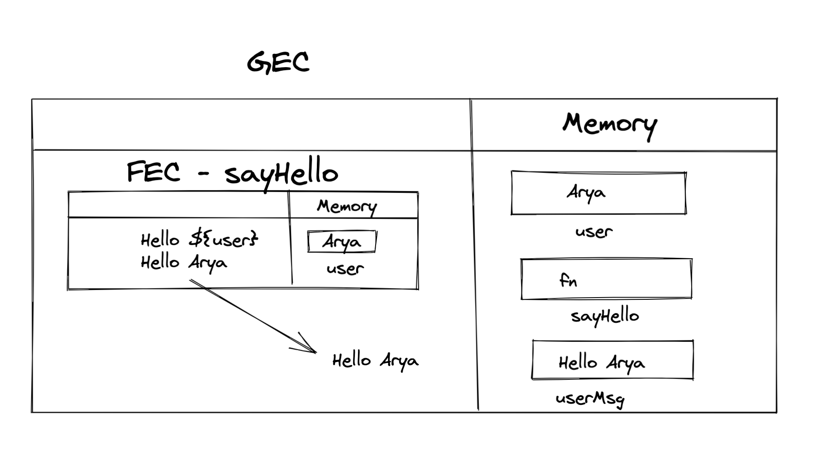
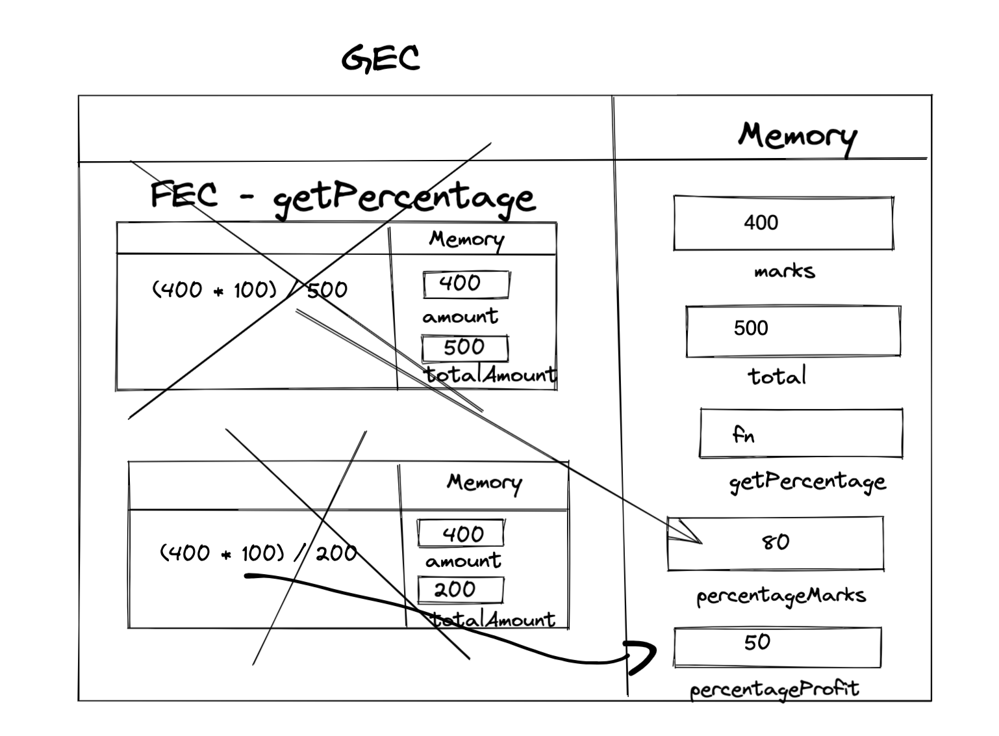
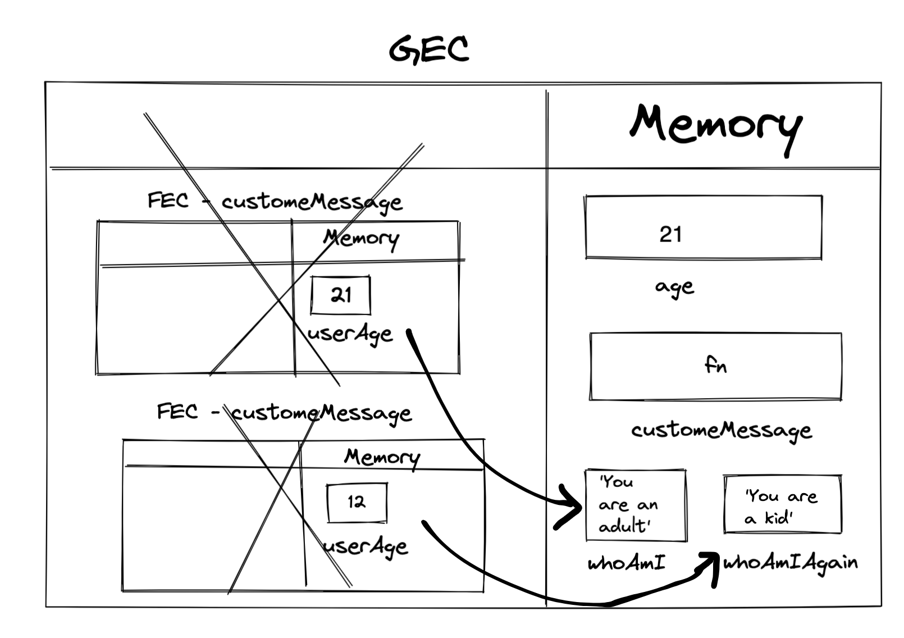

1. What does thread of execution means in JavaScript?

```js
It means that the code is executed line by line.
```

2. Where the JavaScript code gets executed?

```js
In the browser, but also on the server recently. In Javascript Engine.
```

3. What does context means in Global Execution Context?

```js
When js executes code, it creates an execution context. Its the environment where the code gets executed.
```

4. When do you create a global execution context.

```js
When the code is executed for the first time.
```

5. Execution context consists of what all things?

```js
Memory - where values, varibles and functions (i.e. data is stored)
Another part where operations, functions, etc are executed.
```

6. What are the different types of execution context?

```js
Global execution context
Funtion execution context
```

7. When global and function execution context gets created?

```js
Global execution context gets created when a code is first executed.
Function execution context is created whenever a function is executed.
```

8. Function execution gets created during function execution or while declaring a function.

```js
While executing a function.
```


9. Create a execution context diagram of the following code on your notebook. Take a screenshot/photo and store it in the folder named `img`. Use `` to display it here.


```js
var user = "Arya";

function sayHello(){
  return `Hello ${user}`;
}

var userMsg = sayHello(user);
```

<!-- Put your image here -->




```js
var marks = 400;
var total = 500;

function getPercentage(amount, totalAmount){
  return (amount * 100) / totalAmount;
}

var percentageMarks = getPercentage(marks, total);
var percentageProfit = getPercentage(400, 200);
```

<!-- Put your image here -->




```js
var age = 21;

function customeMessage(userAge){
  if(userAge > 18){
    return `You are an adult`;
  }else {
    return `You are a kid`;
  }
}

var whoAmI = customeMessage(age);
var whoAmIAgain = customeMessage(12);
```

<!-- Put your image here -->

