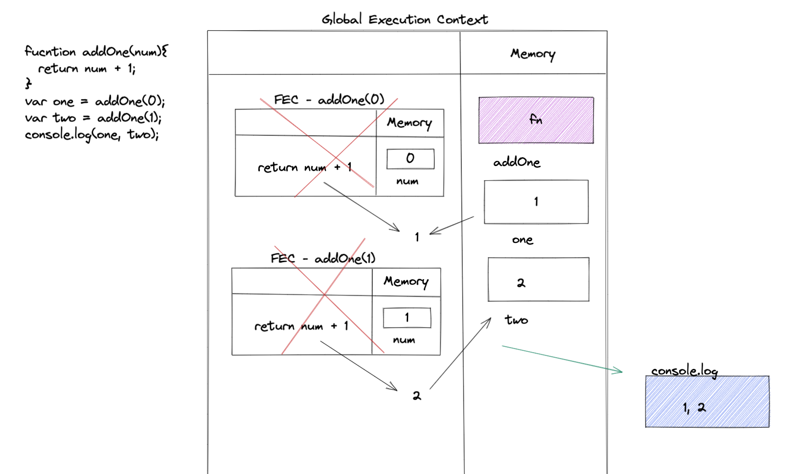
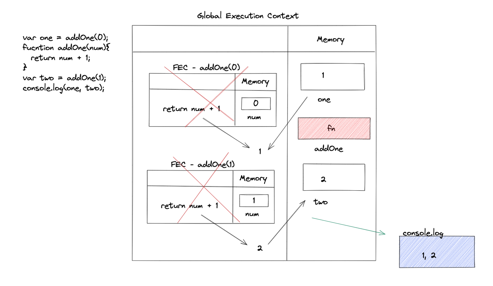
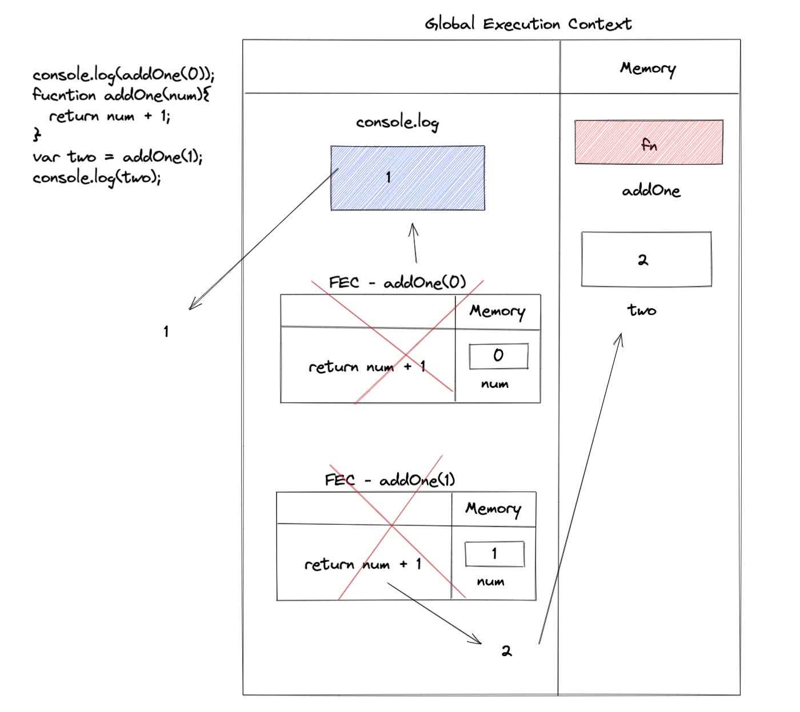
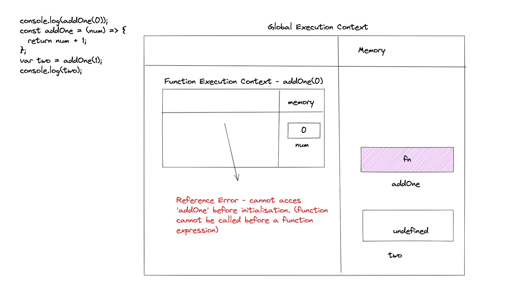

## Understanding Scope and the difference between var, let and const

Watch this video before doing the exercise: https://www.youtube.com/watch?v=XgSjoHgy3Rk

1. Guess the output:

```js
let firstName = 'Arya';
const lastName = 'Stark';
var knownAs = 'no one';

console.log(
  window.firstName,
  window.lastName,
  window.knownAs
);

// undefined
// undefined
// 'no-one'
```

2. Guess the output:

```js
let firstName = 'Arya';
const lastName = 'Stark';
var knownAs = 'no one';

function fullName(a, b) {
  return a + b;
}

console.log(window.fullName(firstName, lastName));

// AryaStark
```

3. Make a Execution Context Diagram for the following JS and write the output.

```js
fucntion addOne(num){
  return num + 1;
}
var one = addOne(0);
var two = addOne(1);
console.log(one, two);
// 1 2
```



4. Make a Execution Context Diagram for the following JS and write the output.

```js
var one = addOne(0);
fucntion addOne(num){
  return num + 1;
}
var two = addOne(1);
console.log(one, two);

//1 2
```



5. Make a Execution Context Diagram for the following JS and write the output.

```js
console.log(addOne(0));
fucntion addOne(num){
  return num + 1;
}
var two = addOne(1);
console.log(two);
// 1
// 2
```



6. Make a Execution Context Diagram for the following JS and write the output.

```js
var one = addOne(0);
const addOne = (num) => {
  return num + 1;
};
var two = addOne(1);
console.log(two);

// ReferenceError: Cannot access 'addOne' before initialization (addOne is a Function expression so it cannot be after a function call)
```


7. Make a Execution Context Diagram for the following JS and write the output.

```js
console.log(addOne(0));
const addOne = (num) => {
  return num + 1;
};
var two = addOne(1);
console.log(two);

// Same as above = Reference Error - cannot access "addOne" before initilisation (addOne is a function expression so it cannot be after a function call)
```



8. What will be the output of the following

```js
function isAwesome() {
  var awesome;
  if (false) {
    awesome = true;
  }
  console.log(awesome);
}
isAwesome();

// undefined
```

9. What will be the output of the following

```js
function isAwesome() {
  let awesome;
  if (true) {
    awesome = true;
  }
  console.log(awesome);
}
isAwesome();

//true
```

10. What will be the output of the following

```js
function isAwesome() {
  let awesome;
  if (false) {
    awesome = true;
  }
  console.log(awesome);
}
isAwesome();

//undefined - there is no value for awesome, so it is initilaised to undefined in the execution phase
```

11. What will be the output of the following

```js
let firstName = 'Arya';
const lastName = 'Stark';
var knownAs = 'no one';

function fullName(a, b) {
  return a + b;
}
const name = fullName(firstName, lastName);
console.log(name);

// AryaStark 
```

12. Guess the output of the code below with a reason.

```js
function sayHello() {
  let name = 'Arya Stark';
}
sayHello();

console.log(name);
// Empty String / undefined - name is not accessible inside function
```

13. Guess the output of the code below with a reason.

```js
if (true) {
  var name = 'Arya Stark';
}
console.log(name);
//Arya Stark - var has global scope and is not confined to the code block
```

14. Guess the output of the code below with a reason.

```js
if (true) {
  let name = 'Arya Stark';
}
console.log(name);
// Empty String / undefined - let has block scope so it cannot be accessed by console.log
```

15. Guess the output of the code below with a reason.

```js
for (var i = 0; i < 20; i++) {
  //
}
console.log(i);

// 20 - i doesn't create scope inside the block
```

16. Guess the output of the code below with a reason.

```js
for (let i = 0; i < 20; i++) {
  //
}
console.log(i);

// ReferenceError: i is not defined - let only has block scope, so it cannot be accessed
```

17. Guess the output and the reason behind that.

```js
function sample() {
  if (true) {
    var username = 'John Snow';
  }
  console.log(username);
}
sample();

// John Snow - var is accessible as it doesn't have block scope
```

18. Guess the output and the reason behind that.

```js
function sample() {
  if (true) {
    let username = 'John Snow';
  }
  console.log(username);
}
sample();

// ReferenceError - username is not defined - let creates block scope so it's not accessible to console.log
```

19. Guess the output and the reason behind that.

```js
function sample() {
  var username = 'Arya Stark';
  if (true) {
    var username = 'John Snow';
    console.log(username);
  }
  console.log(username, 'second');
}
sample();
// John Snow
// John Snow second - var doesn't create block scope
```

20. Guess the output and the reason behind that.

```js
function sample() {
  let username = 'Arya Stark';
  if (true) {
    let username = 'John Snow';
    console.log(username, 'first');
  }
  console.log(username, 'second');
}
sample();
// John Snow first
// Arya Stark second
```

21. Guess the output and the reason behind that.

```js
function sample(...args) {
  for (let i = 0; i < args.length; i++) {
    let message = `Hello I am ${args[i]}`;
    console.log(message);
  }
}

sample('First', 'Second', 'Third');
// Hello I am First
// Hello I am Second
// Hello I am Third - because let creates block scope
```

22. Guess the output and the reason behind that.

```js
function sample(...args) {
  for (let i = 0; i < args.length; i++) {
    const message = `Hello I am ${args[i]}`;
    console.log(message);
  }
}

sample('First', 'Second', 'Third');
// Hello I am First
// Hello I am Second
// Hello I am Third - because let and const  creates block scope
```

23. Guess the output and the reason behind that.

```js
if (true) {
  const myFunc = function () {
    console.log(username, 'Second');
  };
  console.log(username, 'First');
  let username = 'Hello World!';
  myFunc();
}

// ReferenceError: Cannot access 'username' before initialization - username is not defined in const scope
```

24. Guess the output and the reason behind that.

```js
function outer() {
  let movie = 'Mad Max: Fury Road';
  function inner() {
    console.log(
      `I love this movie called ${movie.toUpperCase()}`
    );
  }
  inner();
}

outer();

// I love this movie called MAD MAX: FURY ROAD - will bubble out to the parent looking for the variable
```

25. Guess the output and the reason behind that.

```js
function outer() {
  let movie = 'Mad Max: Fury Road';
  function inner() {
    let movie = 'Before Sunrise';
    console.log(
      `I love this movie called ${movie.toUpperCase()}`
    );
  }
  inner();
}

outer();

// I love this movie called BEFORE SUNRISE - variable first looked for within the function
```

26. Guess the output and the reason behind that.

```js
function outer() {
  let movie = 'Mad Max: Fury Road';
  function inner() {
    let movie = 'Before Sunrise';
    function extraInner() {
      let movie = 'Gone Girl';
      console.log(
        `I love this movie called ${movie.toUpperCase()}`
      );
    }
    extraInner();
  }
  inner();
}
outer();

// I love this movie called GONE GIRL - it will first look for the variable within the function
```

30. Using reduce find the final value when the initial value passed is `100`. You have to pass the output of one function into the input of next function in the array `allFunctions` starts with `addOne` ends with `half`.

```js
const addOne = (num) => {
  return num + 1;
};
const subTwo = (num) => {
  return num - 2;
};
const multiplyThree = (num) => {
  return num * 3;
};
const half = (num) => {
  return num / 2;
};

let allFunctions = [
  addOne,
  subTwo,
  multiplyThree,
  addOne,
  multiplyThree,
  half,
];

allFunctions.reduce((acc, cv) => cv(acc), 100);

// Answer is: 447
```
